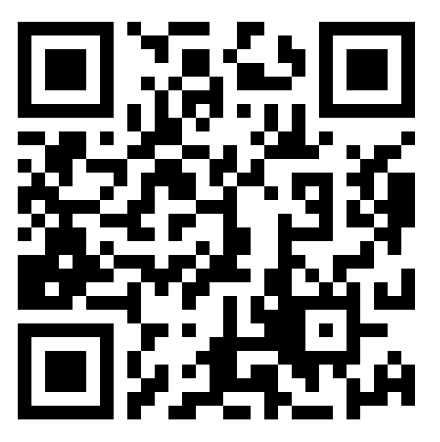

# Webcam to Canvas with JavaScript (HTML5)

## [EvangelistCast Season Episode 020 video - Web Cam and JavaScript Canvas](https://www.youtube.com/watch?v=ClwBub6X6wg)

* Evangelist [Marcio S. Galli](https://www.mgalli.com)
* Video demo [Site Labs Season - Episode 020 - Cam Canvas](https://www.youtube.com/watch?v=ClwBub6X6wg)

## Introduction 

In the early days of browser development, capturing live video and bringing it into the browser required Flash. Back then, this project — *CamCanvas* — offered JavaScript interoperability through a small Flash bridge, allowing developers to grab webcam frames and paint them on a `<canvas>` element for real-time processing.

As web standards evolved, Flash became obsolete. For nearly three years, this library was frozen, while camera access moved to **WebRTC** and **mediaDevices.getUserMedia()**. The Flash approach no longer fits today’s browser environment, and yet, many creative and research-oriented uses of “camera-to-canvas” still matter.

How can we bring back the same creative control — real-time camera capture and pixel manipulation — using pure web technologies? We’ve revived and modernized the original idea with a new **JavaScript API** based purely on **HTML5**, **Canvas**, and **WebRTC**.

### What this project now represents

This project is educational, it serves to help developers make sense of features, it helps us to get ideas in the first place, ideas which may support the execution of real-world projects: 

* A simple **inline JavaScript API** to project webcam video directly into a `<canvas>`.
* Per-pixel manipulation functions (filters such as *emboss*, *gray*, *inverse*, and *red*).
* Automatic or programmatic initialization via `data-webcam-filter` attributes.
* 100% client-side — no plugins, no Flash.

This revival exists to **preserve and extend the culture of camera-based experimentation** on the web: to show that you can still explore, manipulate, and understand visual data locally, in the browser.

## Legacy: Version 0.2 (Flash-Based)

**Webcam to Canvas JavaScript API 0.2** allowed you to capture webcam images from Flash (`.swf`) and transfer them into JavaScript for rendering inside a `<canvas>`. It relied on a small compiled `.swf` (less than 5 KB), created with **Mtasc** and **SwfMill**. Once the webcam image was accessible in JS, developers could manipulate every pixel: filtering, compositing, motion detection — all in real time.

* [Web archived CamCanvas Flash project](https://web.archive.org/web/20140226020722/http://www.taboca.com/p/camcanvas/)

Original intention: 

* **Cam Gestures:** edge/pattern detection experiments
* **Image Manipulation:** background removal, chroma keying, etc.

## Conclusion 

Today, this project stands as both **a historical archive** and **a living bridge** between the early Flash webcam experiments and modern, privacy-friendly WebRTC development.

MIT License

Copyright (c) 2025 Marcio S. Galli

Permission is hereby granted, free of charge, to any person obtaining a copy
of this software and associated documentation files (the “Software”), to deal
in the Software without restriction, including without limitation the rights
to use, copy, modify, merge, publish, distribute, sublicense, and/or sell
copies of the Software, and to permit persons to whom the Software is
furnished to do so, subject to the following conditions:

The above copyright notice and this permission notice shall be included in
all copies or substantial portions of the Software.

THE SOFTWARE IS PROVIDED “AS IS”, WITHOUT WARRANTY OF ANY KIND, EXPRESS OR
IMPLIED, INCLUDING BUT NOT LIMITED TO THE WARRANTIES OF MERCHANTABILITY,
FITNESS FOR A PARTICULAR PURPOSE AND NONINFRINGEMENT. IN NO EVENT SHALL THE
AUTHORS OR COPYRIGHT HOLDERS BE LIABLE FOR ANY CLAIM, DAMAGES OR OTHER
LIABILITY, WHETHER IN AN ACTION OF CONTRACT, TORT OR OTHERWISE, ARISING FROM,
OUT OF OR IN CONNECTION WITH THE SOFTWARE OR THE USE OR OTHER DEALINGS IN
THE SOFTWARE.

--- 

Marcio's additional terms 

LIFE LIFE LIFE PROVIDED "AS-IS" WITHOUT WARRANTIES OF ANY KIND. THE
FOLLOWING TERMS AND CONDITIONS GOVERN YOUR USE OF THIS SERVICE AND ANY
OTHER RELATED MATERIAL. IF YOU DO NOT AGREE TO THE TERMS AND
CONDITIONS PROVIDED HERE, DO NOT USE THE SERVICE.

UNDER NO CIRCUMSTANCES, INCLUDING, BUT NOT LIMITED TO, ANY
CIMCUMSTANCE, SHALL THIS SERVICE, ITS CREATOR AND/OR PARENT ENTITIES
OR AFFILIATES BE LIABLE FOR ANY DIRECT OR INDIRECT, INCIDENTAL, OR
CONSEQUENTIAL DAMAGES FROM THE DIRECT OR INDIRECT USE OF, OR THE
INABILITY TO USE.

THIS SERVICE SHOULD NOT BE USED FOR MISSION CRITICAL APPLICATIONS,
SUCH AS AIRCRAFT CONTROL, RADAR MONITORING, GLOBAL TERMONUCLEAR WAR
CONTROL. LIFE, THOUGHT, CONTENT, OR ANY OTHER RELATED MATERIAL, IS
SUBJECT TO FAILURE OR CHANGES WITHOUT PRIOR NOTICE. THIS AGREEMENT IS
EFFECTIVE TIL TERMINATED BY THE SERVICE CREATOR, AT ANY TIME WITHOUT
NOTICE. IN THE EVENT OF FINAL TERMINATION, YOU ARE NOT LONGER
AUTHORIZED TO LIVE IN, ENJOY, CREATE, MODIFY, AND EVOLVE. USE THIS AT
YOUR OWN RISK AND, JUST ENJOY.

Say thanks if this helped you 

My bitcoin address is: 

bc1qd7y7d2875ujj5uzm2eufe5zjj42ps0ye6g9cq5

